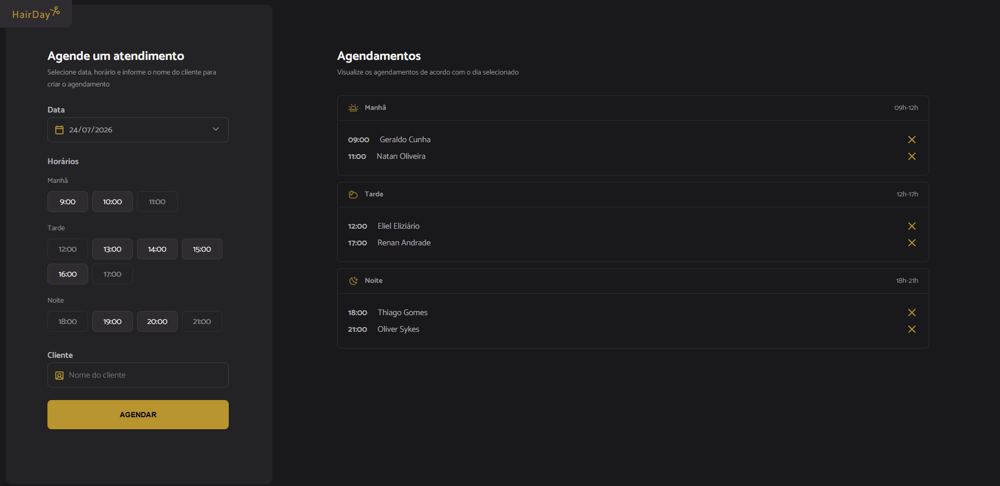

# 💈 HairDay

Aplicação web para agendamento de horários em uma barbearia, desenvolvida durante os estudos da trilha de **Desenvolvimento Fullstack** da [Rocketseat](https://www.rocketseat.com.br/). O projeto tem como objetivo colocar em prática conceitos fundamentais de **JavaScript**, manipulação de datas, requisições HTTP e integração com uma API.

> ⚠️ Projeto de estudo — desenvolvido para fins de aprendizado, não para uso em produção.

## 📸 Screenshot



## ✨ Funcionalidades

- Seleção de data para agendamento
- Listagem de horários disponíveis, calculados dinamicamente a partir do dia/hora atual (horários já passados não ficam disponíveis)
- Seleção visual do horário escolhido
- Criação de novo agendamento
- Listagem dos agendamentos já realizados no dia selecionado
- Cancelamento de agendamentos existentes

## 🚀 Tecnologias utilizadas

- **JavaScript** (ES Modules)
- **Webpack** + **webpack-dev-server** — bundler e servidor de desenvolvimento
- **Babel** (`@babel/preset-env`) — compatibilidade de sintaxe moderna do JS
- **day.js** — manipulação e comparação de datas/horários
- **json-server** — API REST mockada para simular um backend
- **HTML5 / CSS3**

## 📦 Como rodar o projeto

### Pré-requisitos

- [Node.js](https://nodejs.org/) instalado

### Passo a passo

```bash
# Clone o repositório
git clone https://github.com/thiagomve/hairday.git

# Acesse a pasta do projeto
cd hairday

# Instale as dependências
npm install
```

O projeto depende de **dois processos rodando ao mesmo tempo**: a API mockada (json-server) e o servidor de desenvolvimento (Webpack).

```bash
# Terminal 1 — inicia a API mockada (json-server), na porta 3333
npm run server

# Terminal 2 — inicia a aplicação em modo desenvolvimento
npm run dev
```

Acesse a aplicação em `http://localhost:3000` (porta configurada no `webpack.config.js`).

Para gerar a versão de build (produção):

```bash
npm run build
```

Os arquivos finais são gerados na pasta `dist/`.

## 🗂️ Estrutura do projeto

```
hairday/
├── src/
│   ├── assets/                        # imagens, ícones e arquivos estáticos
│   ├── libs/
│   │   └── dayjs.js                   # configuração/instância do day.js
│   ├── modules/
│   │   ├── form/
│   │   │   ├── date-change.js          # lida com a mudança de data selecionada
│   │   │   ├── hours-click.js          # seleção visual do horário clicado
│   │   │   ├── hours-load.js           # calcula e carrega os horários disponíveis
│   │   │   └── submit.js               # envio do formulário de agendamento
│   │   ├── schedules/
│   │   │   ├── cancel.js               # lógica de cancelamento de agendamentos
│   │   │   ├── load.js                 # carregamento dos agendamentos do dia
│   │   │   └── show.js                 # renderiza agendamentos por período
│   │   │   
│   │   ├── page-load.js                # inicialização geral da página
│   │   │
│   │   └── services/
│   │       ├── api-config.js            # configuração da baseURL da API
│   │       ├── schedule-fetch-by-day.js # busca agendamentos filtrados por dia
│   │       ├── schedule-new.js          # cria um novo agendamento
│   │       └── schedules-cancel.js      # cancela um agendamento (DELETE)
│   ├── styles/
│   │   ├── form.css
│   │   ├── global.css
│   │   └── schedule.css
│   ├── utils/
│   │   └── opening-hours.js            # horários de funcionamento da barbearia
│   └── main.js                         # ponto de entrada da aplicação
├── server.json                         # base de dados mockada (json-server)
├── webpack.config.js                   # configuração do bundler
├── package.json
└── index.html                          # template HTML principal
```

## 📚 Aprendizados

Este projeto foi construído com foco em fixar conceitos como:

- Manipulação de arrays com `map`, `filter` e `forEach`
- Trabalho com módulos ES (`import`/`export`)
- Destructuring de objetos e arrays
- Requisições assíncronas com `fetch`, `async/await` e tratamento de erros
- Manipulação de datas e fuso horário com **day.js**
- Configuração de bundler (Webpack) e loaders (CSS, Babel)
- Simulação de uma API REST com **json-server**
- Boas práticas de commits (Conventional Commits)